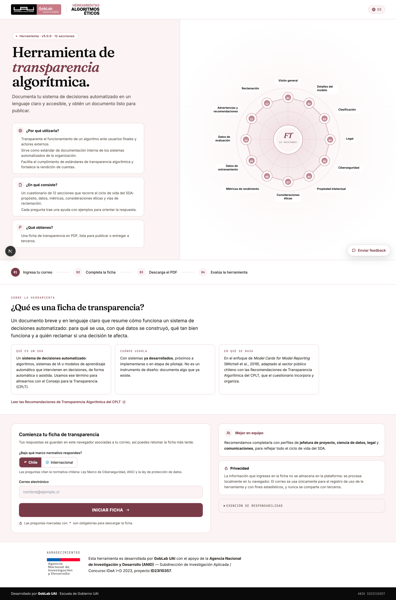
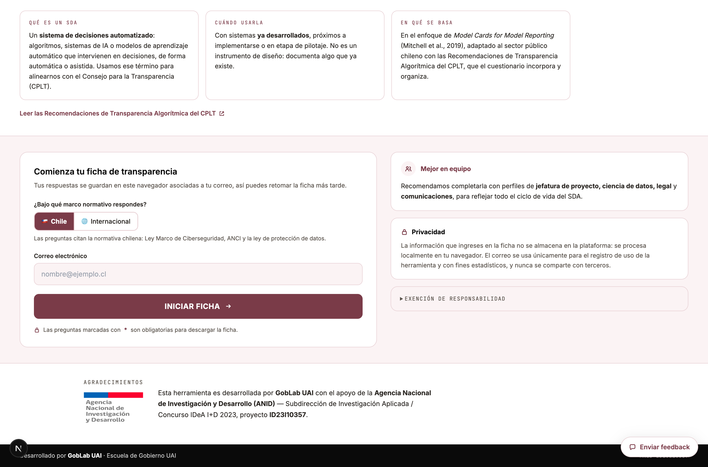
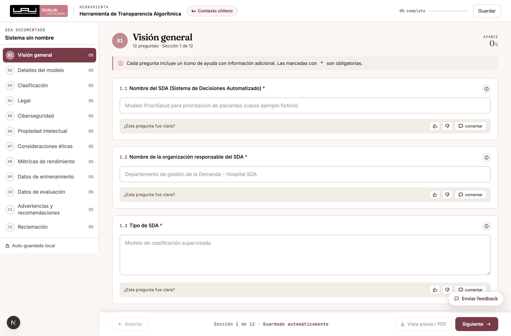
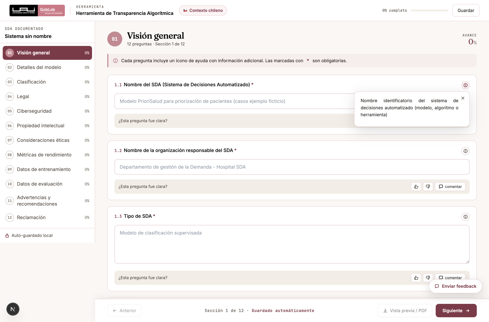
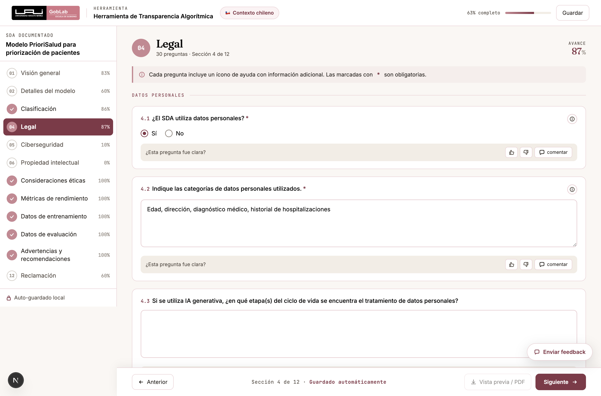
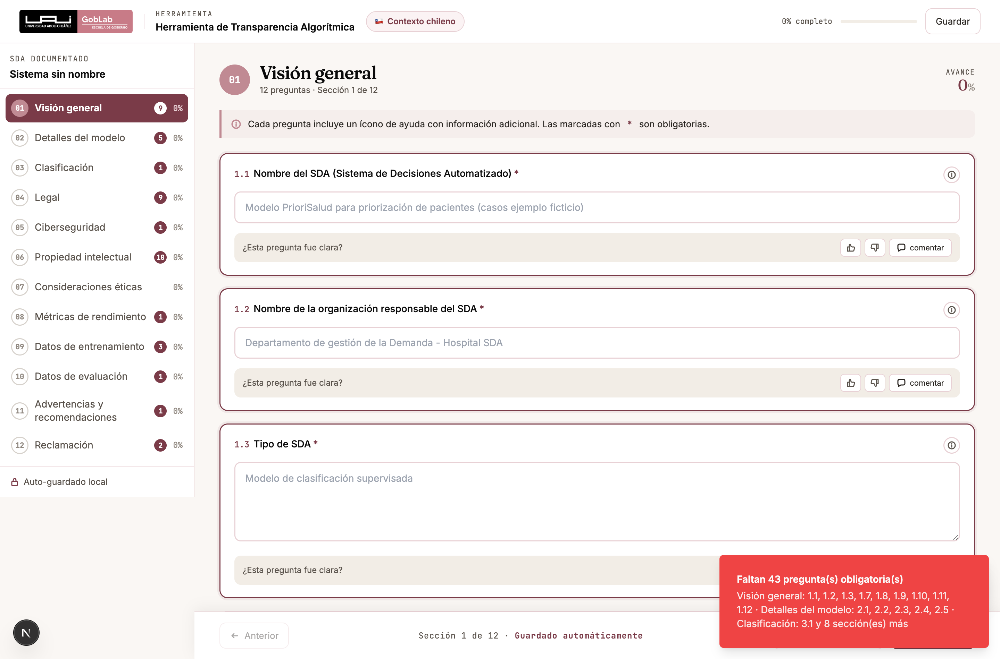
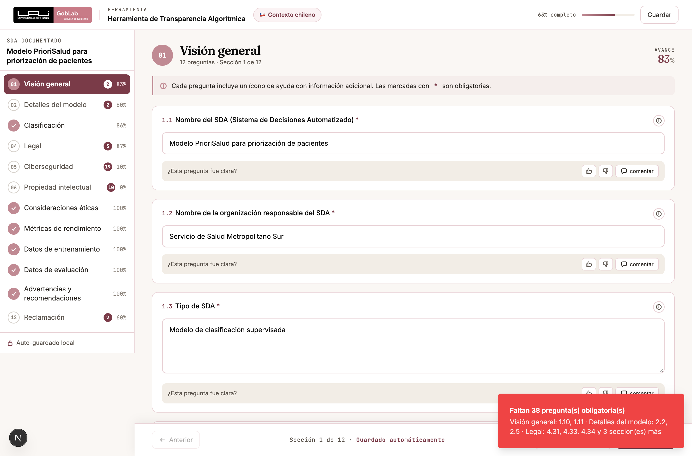
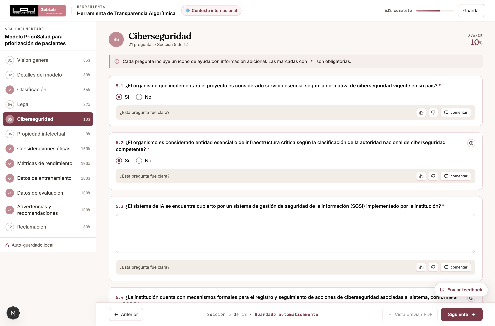
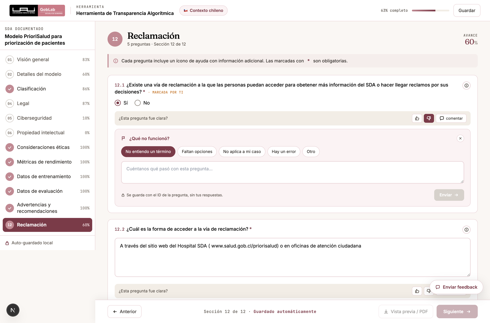

# Manual de Usuario
## Herramienta de Transparencia Algorítmica — GobLab UAI

> Guía paso a paso para elaborar la ficha de transparencia de un sistema de
> decisiones automatizado: cómo recorrer el cuestionario, qué significa cada
> dimensión, por qué algunas preguntas aparecen y desaparecen, y cómo obtener el
> documento final en PDF.
>
> Todas las capturas son de la herramienta real. Los ejemplos usan un caso
> ficticio, **«Modelo PrioriSalud para priorización de pacientes»**, que es el
> mismo que aparece en los textos de ayuda de la herramienta.

---

## Índice

1. [¿Qué es esta herramienta y para qué sirve?](#1-qué-es-esta-herramienta-y-para-qué-sirve)
2. [Antes de empezar](#2-antes-de-empezar)
3. [Conceptos clave](#3-conceptos-clave)
4. [El flujo de trabajo de un vistazo](#4-el-flujo-de-trabajo-de-un-vistazo)
5. [Paso 1 — La portada y el inicio](#5-paso-1--la-portada-y-el-inicio)
6. [Paso 2 — Recorrer el cuestionario](#6-paso-2--recorrer-el-cuestionario)
7. [Paso 3 — Preguntas que aparecen y desaparecen](#7-paso-3--preguntas-que-aparecen-y-desaparecen)
8. [Paso 4 — Completar lo obligatorio](#8-paso-4--completar-lo-obligatorio)
9. [Paso 5 — La encuesta de satisfacción](#9-paso-5--la-encuesta-de-satisfacción)
10. [Paso 6 — Revisar y descargar la ficha](#10-paso-6--revisar-y-descargar-la-ficha)
11. [Cómo darnos tu opinión](#11-cómo-darnos-tu-opinión)
12. [Las 12 dimensiones, una por una](#12-las-12-dimensiones-una-por-una)
13. [Privacidad y qué se guarda](#13-privacidad-y-qué-se-guarda)
14. [Preguntas frecuentes](#14-preguntas-frecuentes)

---

## 1. ¿Qué es esta herramienta y para qué sirve?

Es una herramienta web que te ayuda a construir la **ficha de transparencia** de
un sistema de decisiones automatizado: un documento breve y en lenguaje claro que
resume cómo funciona el sistema, para qué se usa, con qué datos se construyó, qué
tan bien funciona y a quién puede reclamar una persona afectada por sus
decisiones.

La ficha cumple **dos funciones a la vez**:

- **Hacia afuera** — transparenta el funcionamiento del algoritmo ante las
  personas usuarias y ante cualquier tercero interesado.
- **Hacia adentro** — sirve como estándar de documentación interna de los
  sistemas automatizados de la organización.

**¿Para quién?** Equipos de instituciones públicas o privadas que ya tienen un
sistema desarrollado y necesitan documentarlo.

**En qué se basa.** En el enfoque de *Model Cards for Model Reporting* (Mitchell
et al., 2019), adaptado al sector público chileno con las **Recomendaciones de
Transparencia Algorítmica del Consejo para la Transparencia (CPLT)**, que el
cuestionario incorpora y organiza.

> **Importante: no es un instrumento de diseño.** La ficha documenta un sistema
> que **ya existe** y está próximo a implementarse o en etapa de pilotaje. Si tu
> proyecto todavía está en fase de formulación, la herramienta que corresponde es
> la **Evaluación de Impacto Algorítmico (EIA)**.

---

## 2. Antes de empezar

**Reúne al equipo.** La ficha cruza materias técnicas, legales, de seguridad y de
comunicación. Ninguna persona sola suele tener todas las respuestas. Se
recomienda convocar a:

| Perfil | Qué aporta |
|---|---|
| Jefatura de proyecto | Propósito, alcance, uso previsto |
| Ciencia de datos / desarrollo | Tipo de modelo, datos, métricas, umbrales |
| Asesoría legal | Datos personales y sensibles, base de licitud, propiedad intelectual |
| Seguridad de la información | Ciberseguridad, incidentes, continuidad operativa |
| Comunicaciones / atención ciudadana | Vías de reclamación, información al titular |

**Ten a mano.** Nombre y versión del sistema, fecha de implementación,
descripción del modelo y de los datos, resultados de las métricas, y —si aplica—
la política de tratamiento de datos y los procedimientos de ciberseguridad de la
institución.

**Cuánto toma.** El cuestionario tiene **112 preguntas repartidas en 12
dimensiones**, pero **no todas se muestran siempre**: muchas dependen de
respuestas anteriores (ver la [sección 7](#7-paso-3--preguntas-que-aparecen-y-desaparecen)).
Una ficha típica se completa en una o dos sesiones de trabajo en equipo.

---

## 3. Conceptos clave

| Término | Qué significa |
|---|---|
| **SDA** | **Sistema de Decisiones Automatizado**: algoritmos, sistemas de inteligencia artificial o modelos de aprendizaje automático que intervienen en la toma de decisiones, de forma automática o asistida. Se usa este término para alinearse con el vocabulario del CPLT. |
| **Ficha de transparencia** | El documento PDF que produce la herramienta. Es el entregable. |
| **Dimensión** | Cada uno de los 12 bloques temáticos del cuestionario (Visión general, Legal, Ciberseguridad, etc.). |
| **Contexto normativo** | Si respondes bajo la normativa **chilena** o en términos **internacionales**. Cambia la redacción de algunas preguntas y queda declarado en la ficha. |
| **Pregunta condicional** | Una pregunta que sólo aparece si otra fue respondida de cierta forma. |
| **Titular de los datos** | La persona a quien se refieren los datos personales que trata el sistema. |

---

## 4. El flujo de trabajo de un vistazo

```
1. Portada          →  correo + contexto normativo (Chile / Internacional)
2. Cuestionario     →  12 dimensiones · autoguardado en tu navegador
3. Obligatorias     →  la herramienta te dice qué falta y dónde
4. Encuesta         →  una sola vez, antes de generar la ficha
5. Vista previa     →  revisas el documento tal como saldrá
6. PDF              →  "Descargar PDF" → Guardar como PDF
```

Puedes **cerrar el navegador y volver más tarde**: las respuestas quedan
guardadas en tu equipo, asociadas al correo con el que iniciaste.

---

## 5. Paso 1 — La portada y el inicio

La portada explica qué es una ficha de transparencia, en qué consiste el
cuestionario y qué obtienes al final.



El gráfico de la derecha muestra las **12 dimensiones** que vas a recorrer.

### El formulario de inicio



Dos campos, ambos importantes:

**1. Correo electrónico.** No es un registro de usuario ni crea una cuenta: es la
llave con la que la herramienta guarda tus respuestas **en tu propio navegador**.
Si vuelves más tarde con el mismo correo y desde el mismo equipo, recuperas la
ficha donde la dejaste.

**2. ¿Bajo qué marco normativo respondes?** Elige entre:

| Opción | Cuándo usarla | Qué cambia |
|---|---|---|
| 🇨🇱 **Chile** | Instituciones chilenas | Las preguntas citan la normativa chilena: Ley Marco de Ciberseguridad, la Agencia Nacional de Ciberseguridad (ANCI) y la ley de protección de datos |
| 🌐 **Internacional** | Instituciones de otros países | Las mismas preguntas, enunciadas en términos generales ("la normativa de ciberseguridad vigente en su país", "la autoridad nacional competente") |

> **Elige el contexto antes de empezar.** Es la única opción que conviene definir
> de entrada: cambia la redacción de varias preguntas y **queda declarada en la
> ficha final**, porque quien lea el documento debe saber contra qué marco
> normativo se respondió.

Al pulsar **INICIAR FICHA** entras al cuestionario.

---

## 6. Paso 2 — Recorrer el cuestionario



La pantalla tiene tres zonas:

**① Encabezado.** El nombre de la herramienta, el **contexto normativo activo**
(la píldora con la bandera), el **porcentaje global** de avance y el botón
*Guardar*.

**② Barra lateral.** Las 12 dimensiones. De cada una ves:
- el **número** y el título,
- un **visto ✓** cuando ya no le falta ninguna obligatoria,
- el **porcentaje** de preguntas respondidas.

Puedes saltar de una dimensión a otra en cualquier orden. No hay que seguir la
secuencia.

**③ Preguntas.** El cuerpo de la dimensión activa. Arriba a la derecha, el avance
de esa dimensión en particular.

### El autoguardado

No hay botón de "guardar y salir": **cada respuesta se guarda sola** en cuanto la
escribes, en tu propio navegador. La barra inferior lo recuerda con el texto
*"Guardado automáticamente"*, y la lateral con *"Auto-guardado local"*.

El botón **Guardar** del encabezado sólo confirma que todo está guardado; no hace
falta pulsarlo para no perder trabajo.

> **Cuidado:** las respuestas viven en **ese** navegador y **ese** equipo. Si
> cambias de computador o borras los datos de navegación, se pierden. Para
> trabajar en equipo, lo práctico es completar la ficha en una sola máquina —por
> ejemplo, proyectando en una reunión— o descargar el PDF como respaldo
> intermedio.

### La ayuda de cada pregunta

Casi todas las preguntas traen un ícono **ⓘ** a la derecha. Al pulsarlo se abre
una explicación con el alcance de la pregunta y, muchas veces, un ejemplo.



**Úsala.** Varias preguntas usan términos legales o técnicos con un significado
preciso, y la ayuda es la que evita responder otra cosa.

Además, cada pregunta trae un **texto gris de ejemplo** dentro del campo (un
*placeholder*). Es una guía del tipo de respuesta que se espera; desaparece al
escribir.

### Bloques dentro de una dimensión

Las dimensiones largas se subdividen en bloques temáticos, con un rótulo en
mayúsculas. **Legal** tiene ocho:


*Datos personales · Datos sensibles · Decisiones automatizadas con efectos
jurídicos · Base de licitud (consentimiento) · Base de licitud (ley) ·
Procedimiento y evaluación de riesgo · Salvaguardas generales · Deber de
información y transparencia.*

### Tipos de respuesta

| Tipo | Cómo se ve | Ejemplo |
|---|---|---|
| **Texto corto** | Una línea | Nombre del SDA, versión |
| **Texto largo** | Un recuadro de varias líneas | Propósito del proyecto |
| **Sí / No** | Dos opciones en línea | ¿El SDA utiliza datos personales? |
| **Una alternativa** | Lista de tarjetas, se elige una | Base de licitud del tratamiento |
| **Varias alternativas** | Lista de tarjetas con casillas | Causales habilitantes |

Las listas de alternativas se muestran completas, en tarjetas, porque varias son
textos legales largos que no se entienden truncados:



Fíjate en el enunciado: cuando dice *"seleccione la(s) que apliquen"* o *"marque
todas las que aplique"*, **puedes marcar más de una**. Cuando dice *"seleccione
solo una"*, es excluyente.

---

## 7. Paso 3 — Preguntas que aparecen y desaparecen

Esta es la parte que más suele sorprender, así que vale detenerse.

**El cuestionario se adapta a tu sistema.** De las 112 preguntas, **53 son
condicionales**: sólo aparecen si una pregunta anterior fue respondida de cierta
forma. Es deliberado — si tu sistema no usa datos sensibles, no tiene sentido
preguntarte por las causales que habilitan su tratamiento.

**Ejemplos reales del cuestionario:**

- Si en **4.1** («¿El SDA utiliza datos personales?») respondes **No**, no se te
  pregunta por las categorías de datos utilizados.
- Si en **3.1** («¿El SDA categoriza, clasifica o elabora perfiles?») respondes
  **No**, la dimensión *Clasificación* se cierra en esa única pregunta.
- En **Ciberseguridad**, casi toda la dimensión depende de las dos primeras
  preguntas sobre si el organismo es servicio esencial y entidad de
  infraestructura crítica.

### Qué pasa si cambias de opinión

Si vuelves atrás y **cambias la respuesta que abría una rama**, esa rama
desaparece completa — incluidas las preguntas obligatorias que contenía. Eso es
correcto: si ya no aplican, no deben bloquearte ni salir en la ficha.

**Lo que respondiste no se borra.** Queda guardado. Si vuelves a cambiar la
respuesta al valor original, todas las preguntas reaparecen **con lo que ya
habías escrito**. Puedes explorar sin miedo a perder trabajo.

> **Consecuencia práctica:** el porcentaje de avance puede **subir** cuando
> respondes "No" a una pregunta que abría una rama larga. No es un error: el
> denominador se achicó porque esas preguntas dejaron de aplicar a tu caso.

**En la ficha final sólo aparecen las preguntas que efectivamente se te
mostraron.** Una dimensión que quedó sin respuestas visibles no aparece en el
documento.

---

## 8. Paso 4 — Completar lo obligatorio

Las preguntas obligatorias están marcadas con un **asterisco rojo (\*)**. Sólo
bloquean la generación de la ficha las que **están visibles**: una obligatoria de
una rama que no aplica a tu sistema no cuenta.

Si intentas generar la ficha con obligatorias pendientes, la herramienta **te dice
cuáles y te lleva hasta ellas**:



Ocurren tres cosas a la vez:

1. **Un aviso** enumera cuántas faltan y en qué dimensiones, con los números de
   pregunta (*"Visión general: 1.1, 1.2, 1.3… · Detalles del modelo: 2.1, 2.2…"*).
2. **La barra lateral** muestra, junto a cada dimensión, un contador con cuántas
   obligatorias le faltan.
3. **Los campos pendientes se resaltan** con un borde marcado, y la herramienta
   te lleva a la primera dimensión con faltantes.

El resaltado se apaga solo cuando ya no falta nada.

---

## 9. Paso 5 — La encuesta de satisfacción

La primera vez que pulses **Vista previa / PDF** aparece una encuesta breve sobre
tu experiencia con la herramienta.


- Toma menos de dos minutos y **se pide una sola vez**.
- **Puedes omitirla**: el botón *"Omitir y ver la ficha"* al final, o la ✕ de la
  esquina, te llevan igual al documento. La ficha es tuya; la encuesta no la
  retiene.
- Tus respuestas nos sirven para mejorar la herramienta: qué preguntas resultaron
  confusas, si el lenguaje fue accesible para todo el equipo, si el PDF refleja
  bien el proyecto.

---

## 10. Paso 6 — Revisar y descargar la ficha

Al completar las obligatorias visibles, el botón **Vista previa / PDF** de la
barra inferior se habilita y abre el documento tal como quedará.



**Revisa antes de descargar.** Esta pantalla es exactamente el documento final:
mismas dos columnas, mismo orden, mismo contenido.

El documento trae:

- **Encabezado** con el nombre del SDA, la organización responsable, la versión
  declarada del sistema, la fecha de elaboración y **el contexto normativo** bajo
  el que se respondió.
- **Las dimensiones con respuestas**, cada una con sus preguntas y lo que
  contestaste. Las dimensiones sin respuestas visibles no aparecen.
- **La exención de responsabilidad** de la Universidad Adolfo Ibáñez.
- **Un pie** con la licencia, la versión de la herramienta y la fecha.

### Descargar

Pulsa **DESCARGAR PDF**. Se abre el diálogo de impresión del navegador: elige
**"Guardar como PDF"** como destino y confirma.

> **Consejo.** En el diálogo de impresión, deja los márgenes en *Predeterminado*
> y activa **"Gráficos de fondo"** si tu navegador lo pide. Sin eso, el documento
> sale en blanco y negro y pierde la distinción visual entre las secciones.

Si necesitas corregir algo, **Volver al cuestionario** te devuelve sin perder
nada.

### Contexto internacional

Si iniciaste en contexto internacional, el encabezado del cuestionario y el
documento lo declaran, y las preguntas que citaban normativa chilena aparecen
reformuladas:



---

## 11. Cómo darnos tu opinión

Hay dos vías, y sirven para cosas distintas:

**① Por pregunta.** Bajo cada pregunta hay un *"¿Esta pregunta fue clara?"* con
👍 / 👎 y un botón *comentar*.



Al marcar 👎 se abre un panel con motivos frecuentes (*no entiendo un término*,
*faltan opciones*, *no aplica a mi caso*, *hay un error*) y un espacio de texto.
Es la vía más útil para nosotros: llega con el identificador de la pregunta, así
que sabemos exactamente cuál revisar. **No viaja tu respuesta**, sólo tu
comentario.

**② General.** El botón flotante **Enviar feedback**, abajo a la derecha, está
disponible en todo momento para un comentario general, reportar un error o hacer
una pregunta.

---

## 12. Las 12 dimensiones, una por una

| # | Dimensión | Preg. | Oblig. | Qué documenta |
|---|---|---|---|---|
| 01 | **Visión general** | 12 | 9 | Qué es el sistema, quién lo opera, para qué se creó, qué tareas realiza, qué usos quedan fuera de su alcance |
| 02 | **Detalles del modelo** | 5 | 5 | Versión, fecha de implementación, cómo citarlo, licencia y acceso al código |
| 03 | **Clasificación** | 7 | 3 | Si el sistema categoriza o perfila personas, con qué criterios y con qué consecuencias para ellas |
| 04 | **Legal** | 35 | 33 | Datos personales y sensibles, decisiones con efectos jurídicos, base de licitud, salvaguardas y deber de información |
| 05 | **Ciberseguridad** | 21 | 21 | Si la institución es servicio esencial, su sistema de gestión de seguridad, manejo de incidentes y continuidad operativa |
| 06 | **Propiedad intelectual** | 10 | 10 | Contenidos protegidos usados como insumo, licencias, y titularidad de lo que el sistema genera |
| 07 | **Consideraciones éticas** | 4 | 0 | Riesgos éticos identificados, casos problemáticos conocidos y medidas de mitigación |
| 08 | **Métricas de rendimiento** | 4 | 1 | Qué métricas se usan, desde qué valor se considera buen desempeño y qué resultado se obtuvo |
| 09 | **Datos de entrenamiento** | 3 | 3 | Qué datos se usaron, cómo se preprocesaron y por qué se eligieron |
| 10 | **Datos de evaluación** | 2 | 1 | Qué datos se usaron para evaluar y cómo se prepararon |
| 11 | **Advertencias y recomendaciones** | 4 | 1 | Pruebas pendientes, grupos no representados en los datos y recomendaciones de uso |
| 12 | **Reclamación** | 5 | 5 | Si existe vía de reclamación, cómo se accede y si el titular puede pedir revisión de la decisión |

**Las tres dimensiones más densas** —Legal, Ciberseguridad y Propiedad
intelectual— son también las que más se benefician de tener a la persona
adecuada en la sala. Legal y Ciberseguridad, además, son las que más preguntas
condicionales tienen: según cómo respondas las primeras, pueden reducirse
bastante.

---

## 13. Privacidad y qué se guarda

**Tus respuestas no salen de tu navegador.** La ficha se arma y se guarda
localmente en tu equipo. La plataforma **no almacena** el contenido de lo que
escribes.

Lo que sí se registra, con fines estadísticos y de mejora:

| Dato | Cuándo | Para qué |
|---|---|---|
| Tu correo | Al iniciar la ficha | Contabilizar uso de la herramienta |
| Comentarios de feedback | Cuando envías uno | Corregir preguntas confusas. Incluye el identificador de la pregunta, **no tu respuesta** |
| Encuesta de satisfacción | Si decides responderla | Mejorar la herramienta |

Nada de esto se comparte con terceros.

---

## 14. Preguntas frecuentes

**¿Puedo pausar y seguir después?**
Sí. Todo se guarda solo. Vuelve a la portada, ingresa **el mismo correo** desde
**el mismo navegador y equipo**, y retomas donde ibas.

**Perdí las respuestas al cambiar de computador.**
Es esperable: se guardan localmente. Para trabajo en equipo, conviene completar
la ficha desde una sola máquina, o descargar el PDF como respaldo intermedio.

**Desapareció un grupo de preguntas que ya había respondido.**
Cambiaste una respuesta de la que dependían. No se borró nada: vuelve la
respuesta a su valor anterior y reaparecen con todo lo escrito. Ver la
[sección 7](#7-paso-3--preguntas-que-aparecen-y-desaparecen).

**El avance subió después de responder "No" a una pregunta.**
Correcto. Esa respuesta cerró una rama que no aplica a tu sistema, así que el
total de preguntas por responder se achicó.

**No puedo generar la ficha y no encuentro qué falta.**
Pulsa igual *Vista previa / PDF*: la herramienta enumera las que faltan, marca
los contadores en la barra lateral y te lleva a la primera.

**¿Puedo cambiar de contexto normativo a mitad del cuestionario?**
No desde la interfaz. El contexto se elige al inicio. Si necesitas cambiarlo,
vuelve a la portada e inicia de nuevo con el otro contexto.

**El PDF salió en blanco y negro.**
En el diálogo de impresión, activa **"Gráficos de fondo"** (*Background graphics*)
en las opciones adicionales.

**¿Tengo que responder la encuesta para descargar la ficha?**
No. Puedes omitirla y descargar igual.

**Una dimensión completa no aparece en mi ficha.**
Si ninguna de sus preguntas visibles quedó respondida, no se incluye. Es
deliberado: una ficha no debe mostrar secciones vacías.

**¿Esta herramienta certifica que mi algoritmo cumple la normativa?**
No. Es un instrumento de apoyo a la documentación y la transparencia. No
constituye sello ni certificado de aprobación por parte de la Universidad Adolfo
Ibáñez. La exención de responsabilidad completa está en la portada y en el propio
documento.

---

*Herramienta desarrollada por **GobLab UAI**, Escuela de Gobierno de la
Universidad Adolfo Ibáñez, con el apoyo de la Agencia Nacional de Investigación y
Desarrollo (ANID) — Subdirección de Investigación Aplicada / Concurso IDeA I+D
2023, proyecto ID23I10357.*
